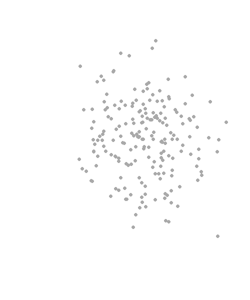

class: middle, inverse

.pull-left[

# Introduction to R
## 1.1 Why R?

#### Lion Behrens, M.Sc.

&nbsp;  
&nbsp;  
&nbsp;    
&nbsp;    
&nbsp;  
&nbsp;    

```{r, echo=FALSE, out.width="100%"}
knitr::include_graphics("Logo_UMA_EN_Weiss.PNG")
```
____________________________________________________________   
University of Mannheim      
Chair of Social Data Science and Methodology      
Chair of Quantitative Methods in the Social Sciences  

]

.pull-right[

```{r, echo=FALSE, out.width="100%"}

```

]
   

---

# Why R?

- **Free** of cost and **open-source**

--

- **Object orientated** programming language
  - functionalities for **all steps in the research process**
  - webscraping, data collection, data wrangling, modeling, statistical simulation 
  - additional functionalities such as **R Markdown**, **R Shiny**, ...
  
--

- Specifically developed for **data analysis**

--

- **Cutting edge** statistical methods get implemented faster than in Stata, SPSS

--

- Very **active R community** across a large number of disciplines that is willing to help
  - [R-Ladies](https://rladies.org/) [<- This is a link]
  - Many local R [user groups](https://jumpingrivers.github.io/meetingsR/r-user-groups.html)
  - R Community on [Stack Overflow](https://stackoverflow.blog/2017/10/10/impressive-growth-r/)
  - *#rstats* hashtag on [Twitter](https://twitter.com/search?q=%23rstats&src=typed_query)

--

- R is your vehicle to **academic research** and the **industry**

