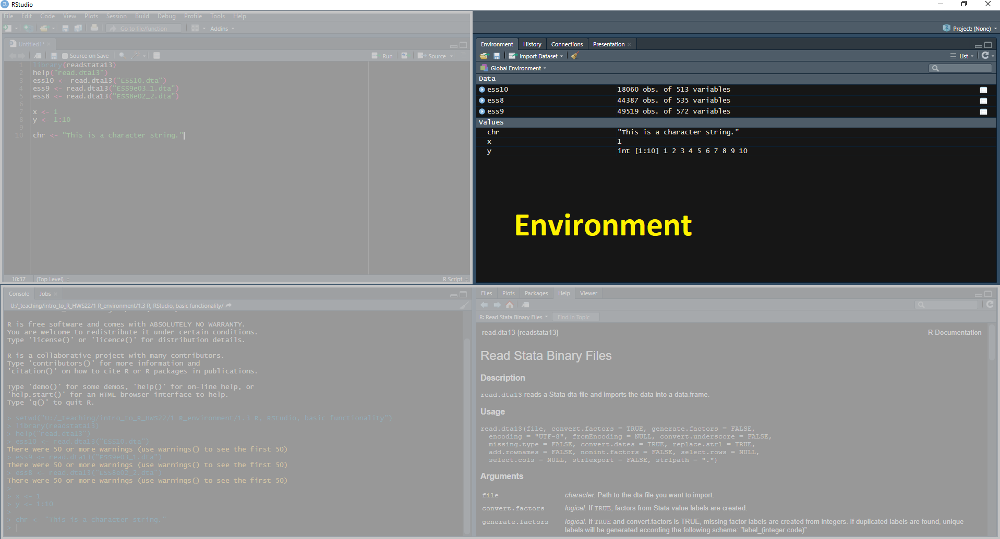

class: middle, inverse

# Introduction to R
## 1.3 R, RStudio and Basic Functionality

#### Lion Behrens, M.Sc.

&nbsp;  
&nbsp;  
&nbsp;    
&nbsp;    
&nbsp;  
&nbsp;    

```{r, echo=FALSE, out.width="50%"}
knitr::include_graphics("Logo_UMA_EN_Weiss.PNG")
```
____________________________________________________________   
University of Mannheim      
Chair of Social Data Science and Methodology      
Chair of Quantitative Methods in the Social Sciences     

---

.pull-left[
```{r echo=FALSE, out.width="15%"}
knitr::include_graphics("fig/r-logo.png")
```

- R is a **statistical programming language** developed for statistical computing and graphics

  - non-commercial implementation of the **S programming language** 
  - basic functionality is referred to as **base R**


]

---

.pull-left[
```{r echo=FALSE, out.width="15%"}
knitr::include_graphics("fig/r-logo.png")
```

- R is a **statistical programming language** developed for statistical computing and graphics
  - non-commercial implementation of the **S programming language** 
  - basic functionality is referred to as **base R**

- R was created in 1993 and version 1.0.0 or R was released in 2000   

]

---

.pull-left[
```{r echo=FALSE, out.width="15%"}
knitr::include_graphics("fig/r-logo.png")
```

- R is a **statistical programming language** developed for statistical computing and graphics
  - non-commercial implementation of the **S programming language** 
  - basic functionality is referred to as **base R**

- R was created in 1993 and version 1.0.0 or R was released in 2000   

- **Packages** extend the basic functionality
  - stored on the **CRAN** server and installed from within R
  - heavily ease ordinary data analysis tasks (data wrangling, modeling, plotting)
  - **implement** advanced and cutting edge **statistical methods**

]
---

.pull-left[
```{r echo=FALSE, out.width="15%"}
knitr::include_graphics("fig/r-logo.png")
```

- R is a **statistical programming language** developed for statistical computing and graphics
  - non-commercial implementation of the **S programming language** 
  - basic functionality is referred to as **base R**

- R was created in 1993 and version 1.0.0 or R was released in 2000   

- **Packages** extend the basic functionality
  - stored on the **CRAN** server and installed from within R
  - heavily ease ordinary data analysis tasks (data wrangling, modeling, plotting)
  - **implement** advanced and cutting edge **statistical methods**
  
- Only comes with a basic Graphical User Interface (GUI)

]
---


.pull-left[
```{r echo=FALSE, out.width="15%"}
knitr::include_graphics("fig/r-logo.png")
```

- R is a **statistical programming language** developed for statistical computing and graphics
  - non-commercial implementation of the **S programming language** 
  - basic functionality is referred to as **base R**

- R was created in 1993 and version 1.0.0 or R was released in 2000   

- **Packages** extend the basic functionality
  - stored on the **CRAN** server and installed from within R
  - heavily ease ordinary data analysis tasks (data wrangling, modeling, plotting)
  - **implement** advanced and cutting edge **statistical methods**
  
- Only comes with a basic Graphical User Interface (GUI)
  
]

.pull-right[
```{r echo=FALSE, out.width="35%"}
knitr::include_graphics("fig/rstudio-logo.png")
```

- RStudio is an intuitive and flexible **interface** for R called **IDE** (Integretated Development Environment)

]
---

.pull-left[
```{r echo=FALSE, out.width="15%"}
knitr::include_graphics("fig/r-logo.png")
```

- R is a **statistical programming language** developed for statistical computing and graphics
  - non-commercial implementation of the **S programming language** 
  - basic functionality is referred to as **base R**

- R was created in 1993 and version 1.0.0 or R was released in 2000   

- **Packages** extend the basic functionality
  - stored on the **CRAN** server and installed from within R
  - heavily ease ordinary data analysis tasks (data wrangling, modeling, plotting)
  - **implement** advanced and cutting edge **statistical methods**
  
- Only comes with a basic Graphical User Interface (GUI)
  
]

.pull-right[
```{r echo=FALSE, out.width="35%"}
knitr::include_graphics("fig/rstudio-logo.png")
```

- RStudio is an intuitive and flexible **interface** for R called **IDE** (Integretated Development Environment)

- Makes R coding fun:
  - Nice overview of created objects, R scripts
  - Syntax highlighting
  - Spell checking
  - Auto-completion
  
]

---

.pull-left[
```{r echo=FALSE, out.width="15%"}
knitr::include_graphics("fig/r-logo.png")
```

- R is a **statistical programming language** developed for statistical computing and graphics
  - non-commercial implementation of the **S programming language** 
  - basic functionality is referred to as **base R**
        
- R was created in 1993 and version 1.0.0 or R was released in 2000
     
- **Packages** extend the basic functionality
  - stored on the **CRAN** server and installed from within R
  - heavily ease ordinary data analysis tasks (data wrangling, modeling, plotting)
  - **implement** advanced and cutting edge **statistical methods**

- Only comes with a basic Graphical User Interface (GUI)

]

.pull-right[
```{r echo=FALSE, out.width="35%"}
knitr::include_graphics("fig/rstudio-logo.png")
```

- RStudio is an intuitive and flexible **interface** for R called **IDE** (Integretated Development Environment)

- Makes R coding fun:
  - Nice overview of created objects, R scripts
  - Syntax highlighting
  - Spell checking
  - Auto-completion 

- We code in **R** by using the **RStudio Interface** 

]

---

# R and the Graphical User Interface

```{r echo=FALSE, out.width="90%"}
knitr::include_graphics("fig/r-gui.png")
```

---

# RStudio Set Up

```{r echo=FALSE, out.width="90%"}

```

---

# RStudio Set Up

```{r echo=FALSE, out.width="90%"}

```

---

# RStudio Set Up

```{r echo=FALSE, out.width="90%"}

```

---

# RStudio Set Up

```{r echo=FALSE, out.width="90%"}

```

---

# RStudio Set Up

```{r echo=FALSE, out.width="90%"}

```
---

# RStudio Set Up

```{r echo=FALSE, out.width="90%"}

```

---

# Basic R Functionality: Calculations

In it's very simplest form, R can just be used as a calculator. 

--

```{r, eval=T}
2+2
```
--

```{r, eval=T}
7^2
```

--

```{r, eval=T}
1/4
```

---

# Basic R Functionality: Comments

When writing code, you can distinguish between two distinct elements of a code chunk
- annotations (denoted by **#**) which will not be executed by R
- genuine code

--

```{r, eval=T}
# This is a comment 
5*30
```

--

```{r, eval=T}
print("Hello World") # This is an in-line comment
```
---

# Basic R Functionality: Philosophy of R

&nbsp;  
&nbsp;  
&nbsp; 

*"To understand computations in R, two slogans are helpful:*

- *Everything that exists is an object.*
- *Everything that happens is a function call."*

--- John Chambers, developer of R. 


---


# Basic R Functionality: Functions

Functions are the workhorse of R programming. Functions take certain **inputs** as **arguments** and produces certain **outputs** given that all input arguments have been specified correctly. 

--

Let's look at the **sqrt** function: 

```{r, eval=T}
# calculate the square root of a number
sqrt(16)
```
--

In order to understand how exactly a function works and to **get help**, type

```{r, eval=F}
help(sqrt)
?sqrt
```

---

# Basic R Functionality: Arithmetic Functions 

This is an **overview** of R's built in arithmetic functions that take a single scalar as an input. 

- `log()`
- `exp()`
- `sqrt()`
- `sin()`
- `cos()`
- `tan()`


---

# Basic R Functionality: Base R Functions

.pull-left[

- `names()`
- `colnames()`
- `rownames()`


- `length()`
- `nrow()`
- `ncol()`
- `dim()`
- `nchar()`


- `which()`
- `which.min()`
- `which.max()`

]

.pull-left[

- `min()`
- `max()`
- `sum()`


- `round()`
- `ceiling()`
- `floor()`


- `c()`
- `cbind()`
- `unique()`


- `rep()`
- `seq()`

]


---


# Basic R Functionality: Objects

Since R is an **object orientated programming language**, values (range of values, character strings, datasets, ...) can be stored in **objects**. This is done using the so-called **assignment operator <-**. An alternative would be using the **equality sign =**.

--

```{r, eval=T}
x <- 5 # a numerical object
chr <- "Exemplary character string."
```

--

Of course, the output of a function can also be assigned to an object. 
```{r, eval=T}
y <- sqrt(16)
y = sqrt(16) # identical
```

--

Objects can be assessed and printed to the **console** by simply typing their name or wrapping it around `print(object)`. 

```{r, eval=T}
y 
```

--

```{r, eval=T}
print(y) # identical
```

---

# R Packages

- **Packages** extend the basic functionality that comes with the installation of **(base) R**

--

- Packages are essentially **collections of functions** 
  - automate tasks for you that otherwise would need your own extensive coding in base R
  - provide documentations of their functions

--

- Packages can be directly installed from within R and are available via [The Comprehensive R Archive (CRAN)](https://cran.r-project.org/)

--

- Working with packages requires a two-step process 

--

```{r, eval=F}
install.packages("stringr") # installing package, only needs to be done once
library(stringr) # loading package, required in every R session
```

---

# An Exemplary Package: stringr
Let's have a look at an exemplary package. Let's first load it into our current R session using `library()` and inspect its documentation using `help()`.

```{r, eval=F}
library(stringr)
help(stringr)
```


.pull-left[

```{r echo=FALSE, out.width="99%"}
knitr::include_graphics("fig/stringr.png")
```

]

.pull-right[

The **stringr** packes provides:

- cohesive set of functions designed to make working with strings as easy as possible 

- fast implementations of common string manipulations

```{r, echo=F, eval=T, warning=F}
library(stringr)
```

```{r, eval=T}
model_string <- str_c("Model ", 1:4)
print(model_string)
```

]

---

# Tidyverse - A Universe of R packages

.pull-left[
```{r echo=FALSE, out.width="60%", fig.align='center'}
knitr::include_graphics("fig/tidyverse-logo.png")
```
]

.pull-right[
[**Tidyverse**](https://www.tidyverse.org/)

- The Tidyverse provides a **collection of packages** all developed and maintained by [Hadley Wickham](https://hadley.nz/) and his team at **RStudio** 

]

---

# Tidyverse - A Universe of R packages

.pull-left[
```{r echo=FALSE, out.width="60%", fig.align='center'}
knitr::include_graphics("fig/tidyverse-logo.png")
```
]

.pull-right[
[**Tidyverse**](https://www.tidyverse.org/)

- The Tidyverse provides a **collection of packages** all developed and maintained by [Hadley Wickham](https://hadley.nz/) and his team at **RStudio** 

- Most prominent examples include **readr** (data import), **dplyr** (data manipulation), **ggplot2** (visulization) and **stringr** (string manipulations)

]

---

# Tidyverse - A Universe of R packages

.pull-left[
```{r echo=FALSE, out.width="60%", fig.align='center'}
knitr::include_graphics("fig/tidyverse-logo.png")
```
]

.pull-right[
[**Tidyverse**](https://www.tidyverse.org/)

- The Tidyverse provides a **collection of packages** all developed and maintained by [Hadley Wickham](https://hadley.nz/) and his team at **RStudio** 

- Most prominent examples include **readr** (data import), **dplyr** (data manipulation), **ggplot2** (visulization) and **stringr** (string manipulations)

- The packages in the tidyverse share an underlying design philosophy, grammar, and data structures and are particularly designed to **work well together**

]

---

# Tidyverse - A Universe of R packages

.pull-left[
```{r echo=FALSE, out.width="60%", fig.align='center'}
knitr::include_graphics("fig/tidyverse-logo.png")
```
]

.pull-right[
[**Tidyverse**](https://www.tidyverse.org/)

- The Tidyverse provides a **collection of packages** all developed and maintained by [Hadley Wickham](https://hadley.nz/) and his team at **RStudio** 

- Most prominent examples include **readr** (data import), **dplyr** (data manipulation), **ggplot2** (visulization) and **stringr** (string manipulations)

- The packages in the tidyverse share an underlying design philosophy, grammar, and data structures and are particularly designed to **work well together**

- You can install the complete tidyverse by typing a single line of code in the console:

```{r, eval=F}
install.packages("tidyverse")
```
]

---


# Tidyverse vs. Base R 

The **Tidyverse** has become so popular for data science in R that it provides substitutes for many common tasks that researchers face in their day-to-day work in R. This has led to a (friendly) **divide** in the R community where some try to rely on the **Tidyverse** as extensively as possible, whereas others prefer to code in **base R**. 

--

.pull-left[
**base R**

- allows for the full spectrum of R programming

- code can easily become long (like *really* long)

- often less readible

- code is built up from scratch 

- you are forced to understand problems and hard-code solutions for yourself

- stable code across time

]


.pull-right[
**Tidyverse**

- only focuses on a subset of common tasks

- code is usually clean and tidy

- often more readible

- set of ready-to-use functions

- quick fixes that are easy to implement even with little understanding

- introduces several dependencies, functionalities keep changing

]

--

Ultimately, you will develop your *own* **coding style** and **philosophy**. 


