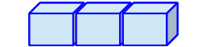

class: middle, inverse

# Introduction to R
## 1.4 Object Classes

#### Lion Behrens, M.Sc.

&nbsp;  
&nbsp;  
&nbsp;    
&nbsp;    
&nbsp;  
&nbsp;    

```{r, echo=FALSE, out.width="50%"}
knitr::include_graphics("Logo_UMA_EN_Weiss.PNG")
```
____________________________________________________________   
University of Mannheim      
Chair of Social Data Science and Methodology      
Chair of Quantitative Methods in the Social Sciences     

---

# Basic R Functionality: Philosophy of R

&nbsp;  
&nbsp;  
&nbsp; 

*"To understand computations in R, two slogans are helpful:*

- *Everything that exists is an object.*
- *Everything that happens is a function call."*

---John Chambers, developer of R.

---

# R Objects - Central Distinction 

The central workhorse in R are **objects** which, in their most general sense, simply **store information**. 
--

.pull-left[

## Data types
### (how your data is stored)

- Numeric values (integers & doubles)

- Character strings

- Boolean values

- Factors

- ...

]

--

.pull-right[

## Data formats
### (where your data is stored)

- Vectors

- Matrices

- Data frames/Tibbles

- Lists

- Arrays

- ...

]

---

# Numeric Values

There are two types of **numerical values** in R. 

--

**Integers** are numbers without a decimal value. To explicitly denote that an object is an integer, you need to place an `L` behind the actual number. 

```{r, eval=T}
x1 <- 5L
typeof(x1)
```

--

**Doubles** are numbers with (a) decimal value(s). 

```{r, eval=T}
x2 <- 5.25
typeof(x2)
```

--

Both `x1` and `x2` are **numeric** objects.

```{r, eval=T}
is.numeric(x1)
```

---

# Numeric Values

There are two types of **numerical values** in R. 

**Integers** are numbers without a decimal value. To explicitly denote that an object is an integer, you need to place an `L` behind the actual number. 

```{r, eval=T}
x1 <- 5L
typeof(x1)
```

**Doubles** are numbers with (a) decimal value(s). 

```{r, eval=T}
x2 <- 5.25
typeof(x2)
```

Both `x1` and `x2` are **numeric** objects.

```{r, eval=T}
is.numeric(x2)
```


---

# Character Strings

A **string** in R simply denotes a series of characters. Importantly, numbers (or any kind of symbol) can also be part of a string. To denote a character string in R, it is simply **wrapped in quotation marks**. 

```{r, eval=T}
string1 <- "University of Mannheim" # example of a string
class(string1)
```

--

```{r, eval=T}
string2 <- "5" # still a string, not an integer as we use quotation marks
class(string2)
```

--

```{r, eval=T}
string3 <- "TRUE" # still a string
class(string3)
```

---

# Factors

Factors are data types that consist of a **pre-defined set** of distinct **categories**, which are called **levels** in R.  

--

- other than numeric objects, factors do not assume their values are continuous (e.g. **ordinal**, **nominal**)

--

- other than character strings, each value of a factor has to correspond to one of the pre-defined levels, while character strings can hold virtually any information 

--

This is an example of a **valid factor operation**: 
```{r, eval=T}
parties <- factor(levels=c("SPD", "CDU", "Greens", "FDP", "AfD", "Left")) # create an empty factor 
parties[1:3] <- c("SPD", "Greens", "FDP") # fill with three values
print(parties)
```

--

This is an example of an **invalid factor operation**: 
```{r, eval=T}
parties[4] <- "CSU" # add invalid value
```

---

# Boolean Values

Boolean (or **logical**) values are either *TRUE* or *FALSE* values. You can produce these values by making **logical requests on your data**. 

--

```{r, eval=T}
(7 - 3) > 1
```

--

Of course, logical values can be stored in objects as well. 

```{r, eval=T}
bool <- 2 > 1 
print(bool)
```

---

# Operators in R 

There are quite a few operators that you can use. 

.pull-left[

#### Arithmetic Operators

- **+** Addition 
- **-** Subtraction 
- **\*** Multiplication 
- **/** Division 
- **^** Exponentiation 
- **%%** Modulus (remainder from division)

]

.pull-right[

#### Relational Operators

- **<** Less than 
- **>** Greater than 
- **<=** Less than or equal to 
- **>=** Greater than or equal to 
- **==** Equal to
- **!=** Not equal to

&nbsp;  
&nbsp; 

#### Logical Operators

- **&** And
- **|** Or

]

---

# Data Formats

Individual objects can be stored in different **data types**, or **containers**. 

```{r, echo=FALSE, out.width="80%"}
knitr::include_graphics("fig/data_types.png")
```

*Source:* [https://devopedia.org/r-data-structures](https://devopedia.org/r-data-structures).

---

# Data Format: Vector

```{r, echo=FALSE, out.width="25%"}

```

Vectors are built by **combining** (or **"concatenating"**) individual objects with `c()`. 

--

```{r, eval=T}
numeric_vector <- c(1, 2, 3, 4, 5)
print(numeric_vector)
```

--

```{r, eval=T}
character_vector <- c("Austria", "England", "Brazil", "Germany")
print(character_vector)
```

--

```{r, eval=T}
logical_vector <- c(TRUE, FALSE, FALSE, TRUE)
print(logical_vector)
```

---

# Data Format: Matrix

```{r, echo=FALSE, out.width="15%"}
knitr::include_graphics("fig/data_matrix.png")
```

- Matrices are the most genuine **rectangular** data format in **R**.

--

- A matrix consists of **n** rows and **k** columns and hence has the dimensionality **n x k **. 

--

```{r, eval=T}
matrix_example <- matrix(1:20, nrow = 4, ncol = 5) # create numeric matrix
print(matrix_example)
```

---

# Data Format: Matrix

```{r, echo=FALSE, out.width="15%"}
knitr::include_graphics("fig/data_matrix.png")
```

- Matrices are the most genuine **rectangular** data format in **R**.

- A matrix consists of **n** rows and **k** columns and hence has the dimensionality **n x k **. 

Let's check the **dimensionality** of this matrix. 

```{r, eval=T}
dim(matrix_example)
```

--

- *Note:* You cannot store multiple data types (e.g. **character strings** and **numeric values** in the same matrix or vector.)

--

- If you attempt this, all of your entries will be **converted to character values**. 

---

# Data Format: Data Frame

```{r, echo=FALSE, out.width="16%"}

```

- Data frames are R's equivalent of **data sets** as you know them from Stata, SPSS or other programs

--

- Data frames also are rectangular of dimensionality **n rows** x **k columns**

--

- *Note:* Data frames store **variables of different classes**. 

--

```{r, eval=T}
df_example <-
  data.frame(
    country = c("Austria", "England", "Brazil", "Germany"), 
    capital = c("Vienna", "London", "Brasília", "Berlin"), 
    elo = c(1761, 1938, 2166, 1988)
  )
```

---

# Data Format: Data Frame

```{r, echo=FALSE, out.width="16%"}

```

- Data frames are R's equivalent of **data sets** as you know them from Stata, SPSS or other programs

- Data frames also are rectangular of dimensionality **n rows** x **k columns**

- *Note:* Data frames store **variables of different classes**. 

```{r, eval=T}
print(df_example)
```

---

# Data Format: Data Frame

```{r, echo=FALSE, out.width="16%"}

```

- Data frames are R's equivalent of **data sets** as you know them from Stata, SPSS or other programs

- Data frames also are rectangular of dimensionality **n rows** x **k columns**

- *Note:* Data frames store **variables of different classes**. 

```{r, eval=T}
dim(df_example) # dimensions of the data frame
```

---

# Data Format: Data Frame

```{r, echo=FALSE, out.width="16%"}

```

- Data frames are R's equivalent of **data sets** as you know them from Stata, SPSS or other programs

- Data frames also are rectangular of dimensionality **n rows** x **k columns**

- *Note:* Data frames store **variables of different classes**. 

```{r, eval=T}
nrow(df_example) # number of observations
```

---

# Data Format: Data Frame

```{r, echo=FALSE, out.width="16%"}

```

- Data frames are R's equivalent of **data sets** as you know them from Stata, SPSS or other programs

- Data frames also are rectangular of dimensionality **n rows** x **k columns**

- *Note:* Data frames store **variables of different classes**. 

```{r, eval=T}
ncol(df_example) # number of variables
```

---

# Data Format: List

Essentially, lists just **bind** any number of objects **together**, even if these are of **different classes**.

--

```{r, eval=T}
list_example <- 
  list(numeric_vector, 
       character_vector, 
       logical_vector, 
       matrix_example, 
       df_example)
```

---

# Data Format: List

```{r, eval=T}
print(list_example)
```


